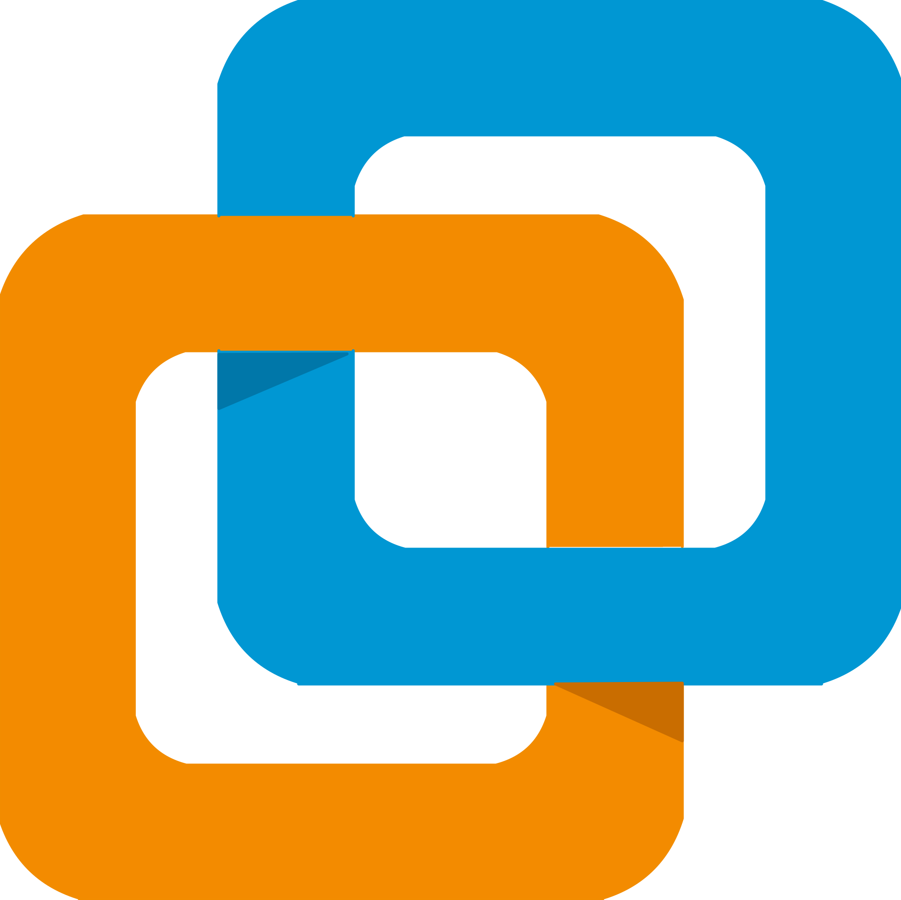

#  About me

🎓 **Undergraduate student at [Hanoi University of Science and Technology](https://soict.hust.edu.vn/), majoring in Cyber Security IT-E15**

🎯 **Career Goal:** Aspiring Cyber Security Engineer with a passion for protecting 
systems and data from cyber threats.

🌟 **Interests:** Cyber Security, Artificial Intelligence, Finance

🎭 **Hobbies:** 🎮, 🏋️, 🚴‍♂️

 

#  Skills

- **Languages:**

  
  
  
  
  
  

- **Web:**
  

  
  
  
  

- **AI:**

  
  
  
  

- **Tools:**

  
  
  
  
  
  

 

# 🚀 Projects

Here are all the projects in my repository, organized in in chronological order. Each project reflects both the challenges and joys 
experienced with my teammates. These experiences have imparted valuable 
lessons and motivated me to push my boundaries. Looking back, I am proud of the progress I've made.

### 2025.1
> * [**IT4630E — Malware Analysis**](https://github.com/chutrunganh/Netflow-Based-Malware-Detection-and-Data-Visualization-System-IT4630E)   _Botnet detection using Netflow data_
> * [**IT4508E — Software Security**]()   _Updating_
> * [**IT4450E — Digital Forensics**]()   _Updating_

### 2024.2
> * [**IT4403E — Secure Web Development**](https://github.com/chutrunganh/Stock-Trading-Platform.git)   _Stock Trading Platform with security-focused_
> * [**IT3180E — Intro to Software Engineering**](https://github.com/chutrunganh/Stock-Market-Simulator.git)   _Stock Market Simulator_
> * [**IT3930E — Project II**](https://github.com/chutrunganh/Project2-Research-and-Deploy-Suricata-IDS.git)   _Research & deploy Suricata IDS_
> * [**IT4527E — Blockchain & Application**](https://github.com/chutrunganh/Blockchain-and-Applications-IT4527E.git)   _Lab 2, 3_
> * [**IT4025E — Applied Cryptography**](https://github.com/chutrunganh/Applied-Cryptography-IT4025E)   _Projects 1, 2, 3_

### 2024.1
> * [**IT4432E — Biometric**](https://github.com/chutrunganh/Biometric_IT4432E.git)   _2D Face Authentication System_
> * [**IT4785E — Mobile Programming**](https://github.com/chutrunganh/SNote-IT4785E.git)   _Note taking app with sync between devices_
> * [**IT3070E — Operating System**](https://github.com/chutrunganh/Dining-philosophers-problem.git)   _Dining Philosopher problem (Deadlock handling)_

### 2023.2
> * [**IT3910E — Project I**](https://github.com/chutrunganh/Project-I-Collect-SNMP-Data)   _SNMP Browser_
> * [**IT3190E — Machine Learning**](https://github.com/chutrunganh/Fraud-Credit-Card-Detection-Group-17.git)   _Credit card fraud detection_
> * [**IT3100E — OOP**](https://github.com/chutrunganh/OOP.20232.21.git)   _Virus Explorer_
> * [**IT2022E — Applied Statistics**](https://github.com/chutrunganh/Stock-Price-Prediction-Using-Time-Series.git)   _Stock price prediction using time-series_

### 2023.1
> * [**IT3052E — Optimization**](https://github.com/chutrunganh/Optimization-Project-IT3052E.git)   _Bin packing problem_
> * [**IT3052E — Optimization**](https://github.com/chutrunganh/Simplex-Method.git)   _Solving constraints using the Simplex method_

 

# 📬 How to reach me

  
  
  

